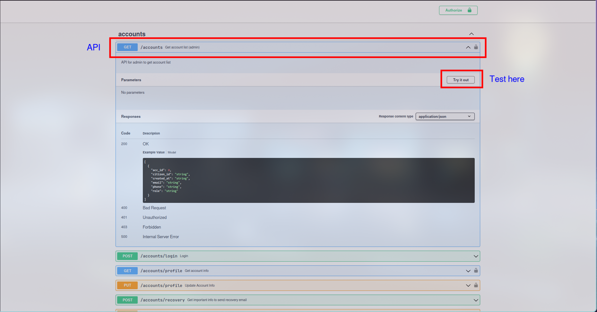

# MeReMa Server

## Tools used
- `docker` and `docker-compose` for PostgreSQL dockerimage (to ensure synchronization between devs)
- [`dbmate`](https://github.com/amacneil/dbmate) for database migration. This tool act like **Git** for database schema
- [`swaggo/swag`](https://github.com/swaggo/swag) for API documentation. This especially useful for frontend dev as they can test API directly from SwaggerUI generated by `swaggo`.

- `Makefile` for simplifying commands running and synchronization of $ENV.

## Main structure

- `/api`: provides api for clients
- `/services`: handles app's core business logics
- `/repo`: handles communication with database
- `/models`: describes DTOs, errors and permissions, share betwwen 3 layers of server

## Required envs (setup a .env, see .env.example)
- `GMAIL_USERNAME` (ex: haha@gmail.com, ...) 
- `GMAIL_PASSWORD` (google app password, 12 char long)
- `JWT_SECRET` (a non-empty string)
- `JWT_SESSION_EXPIRATION` (an integer, measured in minutes)
- `JWT_RECOVERY_EXPIRATION` (an integer, measured in minutes)
- `JWT_REGISTRATION_EXPIRATION` (an integer, measured in minutes)
- `FILE_STORAGE_PATH` (an absolute path or relative path, where files, images will be stored)

## Server setup (for Linux devs only)
- Clone this repo: `git clone https://github.com/MeReMa-UIT/server`
- Install `docker`, `docker-compose` and `dbmate`
- Run `make setup` to install golang's dependecies and tools (this doesn't include `docker`, `docker-compose` and `dbmate`)
- Run `make migrate-up` for database schema update.
- Run `make` or `make run`
- Swagger UI is available at http://localhost:8080/swagger/index.html

## Server testing
- Admin 1: 
  - **ID**: 123123123123 (or 23520199@gm.uit.edu.vn)
  - **Password**: 123456
- Admin 2: 
  - **ID**: 123412341234 (or 23521734@gm.uit.edu.vn)
  - **Password**: 123456
- Receptionist 1:
  - **ID**: 000000001111
  - **Password**: 123456
- Doctor 1:
  - **ID**: 000000001112
  - **Password**: 123456
- Patient 1:
  - **ID**: 000000001113
  - **Password**: 123456